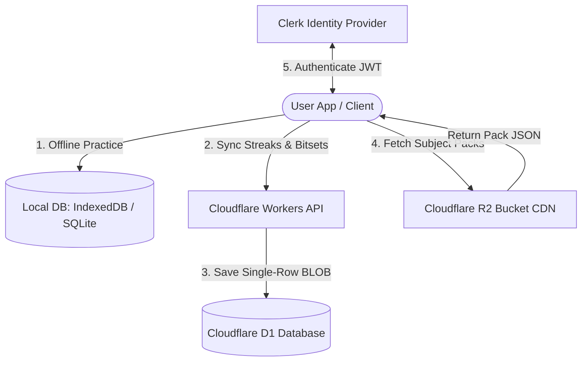

# 🩺 OpenMedQ

[](./LICENSE)
[](https://expo.dev/)
[](https://react.dev/)
[](https://clerk.com/)
[](https://workers.cloudflare.com/)
[](https://pages.cloudflare.com/)

**OpenMedQ** is a high-performance, open-source medical MCQ practice application designed specifically for NEET PG, FMGE, and INI-CET aspirants. Built with developer-student ergonomics in mind, the platform operates entirely within the **Cloudflare Free Tier ($0/month)** while delivering premium features: a local-first study engine, spaced repetition scheduling, gamified level tiers, and cross-device synchronization.

---

## 🎯 Key Features

*   **⚡ Local-First Performance**: Instantaneous question loading, navigation, and exam tracking with Dexie IndexedDB (web) and SQLite/MMKV (mobile).
*   **🧠 FSRS Spaced Repetition**: Integrates the state-of-the-art *Free Spaced Repetition Scheduler* (FSRS) algorithm directly on the client to optimize study intervals and maximize active recall retention.
*   **🎮 Gamified Study Loops**: Levels, experience point (XP) metrics, and study streaks to build consistent daily practice habits.
*   **☁️ Secure Cloud Sync**: Zero-friction login via Clerk with background D1 database synchronization. 
*   **📶 100% Offline Capability**: Download entire subject packs and practice MCQs with full scheduling capabilities even when completely offline.

---

## 🏗️ System Architecture

OpenMedQ is optimized for massive scale on a $0/month budget. It shifts heavy query computations to client runtimes and leverages static content delivery networks:



### 💸 Free-Tier Exploits Explained:
1.  **R2 CDN Question Packs**: MCQ packs are pre-compiled by subject and topic into static JSON files and served directly from a Cloudflare R2 bucket. This bypasses API processing and D1 database query quotas, achieving $0 CDN cost.
2.  **Compressed Progress Bitsets**: Instead of writing to the database on every single question answered, the client serializes answering history into compressed binary bitsets. This is synced in a single-row BLOB update to D1, saving **99.9% of D1 write quota limits**.
3.  **Client-Side Scheduling**: FSRS calculations are processed locally inside browser JS and mobile Hermes engines, keeping server loads strictly focused on lightweight synchronization.

---

## 📁 Repository Structure

OpenMedQ is structured as an npm workspaces monorepo:

*   **[`/frontend`](./frontend/)**: React SPA built with Vite and Tailwind CSS. Deployed to Cloudflare Pages.
*   **[`/mobile`](./mobile/)**: React Native mobile app built with Expo and Expo Router.
*   **[`/backend`](./backend/)**: Serverless Hono API backend running on Cloudflare Workers.
*   **[`/shared`](./shared/)**: Shared TypeScript types, subject data configurations, and common logic libraries.

---

## 🛠️ Local Development Setup

### Prerequisites
- Node.js 20 (recommended) or Node.js 18+
- npm v10+

### 1. Install Dependencies
Run the installation command in the workspace root:
```bash
npm install
```

### 2. Configure Environment Variables
*   **Backend (`/backend/.dev.vars`)**:
    ```env
    CLERK_PUBLISHABLE_KEY=pk_test_...
    CLERK_SECRET_KEY=sk_test_...
    ```
*   **Frontend (`/frontend/.env.local`)**:
    ```env
    VITE_CLERK_PUBLISHABLE_KEY=pk_test_...
    VITE_API_URL=http://localhost:8787
    VITE_CDN_URL=http://localhost:8787/api/assets
    ```
*   **Mobile (`/mobile/.env`)**:
    ```env
    EXPO_PUBLIC_CLERK_PUBLISHABLE_KEY=pk_test_...
    EXPO_PUBLIC_API_URL=http://localhost:8787
    EXPO_PUBLIC_CDN_URL=http://localhost:8787/api/assets
    ```

### 3. Start Development Servers
Run the dev task in the root directory:
```bash
npm run dev
```
- **Web App**: `http://localhost:5173`
- **Workers API**: `http://localhost:8787`

To run the mobile app locally:
```bash
npm run start -w mobile
```

---

## 🚀 Deployment & Distribution

*   **Web Production App**: Deployed on [Cloudflare Pages](https://openmedq.com)
*   **API Service**: Hosted on [Cloudflare Workers](https://api.openmedq.com)
*   **Android Mobile Distribution**: Download the compiled `.apk` directly from the [GitHub Releases Page](https://github.com/Riso19/openmedq/releases).

---

## 📜 License

This project is licensed under the MIT License. See the [LICENSE](./LICENSE) file for details.
