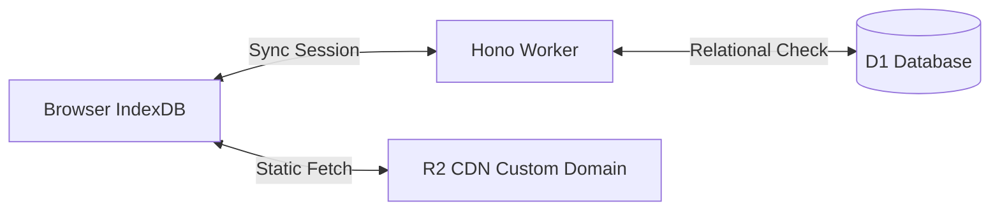

# OpenMedQ Compact Tech Stack & Free-Tier Exploits

Dense architecture reference. MCQ practice app runs on Cloudflare Free Tier.

---

## 🛠️ Stack & Rationale

*   **UI:** Vite + React + TS (SPA) on **Cloudflare Pages** ($0$ static bandwidth).
*   **Style:** Tailwind v4 + shadcn/ui.
*   **State:** TanStack Query + Dexie.js (IndexedDB).
*   **API:** Hono on **Cloudflare Workers** (<14KB, zero cold start).
*   **DB:** Cloudflare D1 (SQLite, 5M reads, 100k writes, 500MB free).
*   **Blob:** Cloudflare R2 (10GB, 10M reads/month, $0$).
*   **Auth:** Clerk (10k MAU free) + edge JWT validation.
*   **Email:** Resend (3k free/month).

---

## ⚡ Aggressive Free-Tier Hacks

### 1. Static Question Packs on R2 (0 Worker Requests, 0 D1 Reads)
*   **Problem:** 194k MCQs. D1 queries hit 5M read limit fast.
*   **Exploit:** Group questions by subject/topic into JSON (e.g., `anatomy_easy_1.json`). Host in **R2 public bucket** + custom domain.
*   **Result:** Client pulls directly from R2 CDN. Caches forever. **0 Worker requests, 0 D1 reads** on hit.

### 2. Compressed Progress Bitsets (99.9% D1 Write Savings)
*   **Problem:** Single row per answer hits 100k D1 write limit fast.
*   **Exploit:**
    *   Store logs in client `IndexedDB`.
    *   Sync cloud state to D1 in 1 row per user:
        *   `correct_bitset`: BLOB or base64.
        *   `incorrect_array`: Compressed JSON list of incorrect question IDs.
    *   **Result:** Syncing 50 answers takes **1 write** instead of 50. Unlimited scaling.

### 3. Local-First Engine & Guest Mode (Bypass Clerk 10k MAU)
*   **Exploit:** Generate quizzes, track scores, run SM-2 algorithm locally in browser using IndexedDB.
*   **Result:** 100% features work without login. Login only for sync/leaderboard. Saves Clerk MAUs.

### 4. Edge Cache API (`caches.default`)
*   **Exploit:** Cache dynamic API (e.g., `GET /api/leaderboard`) in Edge Cache API.
*   **Result:** Return cache in `< 0.5ms` CPU time, prevent timeouts.

---

## 💾 Schema (Drizzle ORM)

```typescript
import { sqliteTable, text, integer, blob } from 'drizzle-orm/sqlite-core';

// Subjects
export const subjects = sqliteTable('subjects', {
  id: integer('id').primaryKey({ autoIncrement: true }),
  name: text('name').notNull().unique(),
});

// Topics
export const topics = sqliteTable('topics', {
  id: integer('id').primaryKey({ autoIncrement: true }),
  subjectId: integer('subject_id').references(() => subjects.id),
  name: text('name').notNull(),
});

// Question Metadata Index (Full body is in R2 JSON packs)
export const questions = sqliteTable('questions', {
  id: integer('id').primaryKey({ autoIncrement: true }),
  subjectId: integer('subject_id').references(() => subjects.id),
  topicId: integer('topic_id').references(() => topics.id),
  examType: text('exam_type'), // NEET_PG, FMGE, INICET
  examYear: integer('exam_year'),
});

// Users
export const users = sqliteTable('users', {
  id: text('id').primaryKey(), // Clerk ID
  email: text('email').notNull().unique(),
  displayName: text('display_name'),
  createdAt: integer('created_at').notNull(),
});

// User State (Compressed Progress Blob)
export const userState = sqliteTable('user_state', {
  userId: text('user_id').primaryKey().references(() => users.id),
  incorrectIds: text('incorrect_ids'), // Compressed JSON array of incorrect IDs
  bookmarkedIds: text('bookmarked_ids'), // Compressed JSON array of bookmarks
  progressData: blob('progress_data'), // Gzipped progress bitset
  updatedAt: integer('updated_at').notNull(),
});
```

---

## 📐 Data Flow Diagram


